<!-- TOC -->

- [基于xilinx MIG DDR4 axi4访问example](#基于xilinx-mig-ddr4-axi4访问example)
    - [example生成steps](#example生成steps)
- [DDR基础知识](#ddr基础知识)
- [MIG 配置说明](#mig-配置说明)
    - [Memory Controller](#memory-controller)
    - [Phy](#phy)
- [JEDEC Standard](#jedec-standard)
    - [Pinout Description](#pinout-description)
    - [State Diagram Command Definitions](#state-diagram-command-definitions)
    - [Basic Functional Description](#basic-functional-description)
    - [RESET and Initialization Procedure](#reset-and-initialization-procedure)
    - [Register Definition](#register-definition)
        - [Programming Mode Registers](#programming-mode-registers)
        - [Mode Register](#mode-register)
    - [Command Truth Table](#command-truth-table)
        - [ACTIVATE Command](#activate-command)
        - [PRECHARGE Command](#precharge-command)
        - [REFRESH Command](#refresh-command)
        - [READ Operation](#read-operation)
        - [WRITE Operation](#write-operation)

<!-- /TOC -->
# 基于xilinx MIG DDR4 axi4访问example  
> 以xczu2eg芯片通过MIG 配置单颗 MT40A256M16 DDR4颗粒仿真为例。  
## example生成steps  
> 此处只介绍生产example的步骤，相关过程中的介绍在后续展开详细说明。

1. 找到ip  
        
2. 配置ip
选项说明

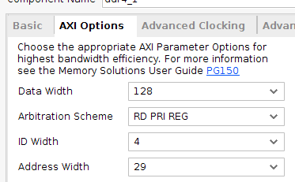
3. 生成xilinx自带的仿真example
- 等待ip综合完成后打开example

4. 仿真
- 使用vvd仿真
直接开始仿真就行，可以run all，直到仿真自动停止。
- 或者使用vcs仿真

- 在sim_tb_top.sv加入fsdb选项
 ```verilog
 initial
 begin
     $fsdbDumpfile("tb.fsdb");
     $fsdbDumpvars(0,sim_tb_top,"+all");
 end
 ```
 - 修改sim_tb_top.sh
 加入kdb选项以支持verdi
 
 编译时会提示缺少include`文件，需要加入仿真模型
 
 - bsub -Is ./sim_tb_top.sh &
5. 修改ddr4_v2_2_data_gen.sv
```verilog
      always @ (*) begin
        lfsr_q_nxt <= lfsr_q;
        if (pattern_init) begin //pattern initialisation
        //lfsr_q_nxt <= #TCQ {prbs_seed_i + 32'h55555555};
        lfsr_q_nxt <= #TCQ {prbs_seed_i + 32'h13572468};
        end
        else if (data_en) begin //generate next data packet
        // lfsr_q_nxt[32:9] <= lfsr_q[31:8];
        // lfsr_q_nxt[8]    <= lfsr_q[32] ^ lfsr_q[7];
        // lfsr_q_nxt[7]    <= lfsr_q[32] ^ lfsr_q[6];
        // lfsr_q_nxt[6:4]  <= lfsr_q[5:3];
        // 
        // lfsr_q_nxt[3]    <= lfsr_q[32] ^ lfsr_q[2];
        // lfsr_q_nxt[2]    <= lfsr_q[1] ;
        // lfsr_q_nxt[1]    <= lfsr_q[32];
        lfsr_q_nxt <= lfsr_q + 1;
        end
    end
```
> 修改一下自动生成的数据，方便观察axi到dq的数据映射。不改也行。
6. 简单看一下仿真波形
- 先关注cmdName信号（设置为ASCII格式），仿真开始后经过一段时间的ACT/NPO后会进行MRS操作（圆圈处），之后init_complete拉高，axi总线动作，开始访问DDR。

# DDR基础知识
- 半导体存储概念

- 认识DDR 内存条

以一根DDR内存条为例，从大到小的层级结构依次是：channel ＞ DIMM ＞ rank ＞ chip ＞ bank ＞ row/column。
channel （对应多个DDR控制器）> DIMM（内存插槽） > rank（一次访问位宽决定，也成物理bank） > chip（1个chip大多是4bit/8bit/16bit等，由多个chip组成一个rank，配合完成一次访问的位宽要求。这就是颗粒。） > bank（颗粒里的logic-bank，DDR3一般对应8个bank存储体） > row/column。

- DDR Page的概念和理解
- DDR页的概念，是针对刷新或者访问来说的，举例，一个rank可能有4个chip组成，一个chip里可能有8个bank，每一个bank有N个行。页指的一个rank里每个chip里的所有bank的某个行地址；注意不是一行，是多行，行数是chip数目*bank数目。
- 所以，DDR页，可以理解为一个rank里每个chip（所有bank）的行地址
- 在一个rank里，每个chip的地址是相同的。因为多个chip组成一个总数据位宽。DDR接口的cs信号，虽然叫chip select，其实是rank（一chip）的 select。
- DDR页的概念，会涉及页命中、页miss等，跟cache page原理一样。
# MIG 配置说明
> 参考pg150
1. Mode & Interface
从左往右分别为：
- 用户逻辑层：要送进DDR存储起来的数据源，比如CMOS，ADC等模块采集的数据集；
- 用户接口层： xilinx mig有user interface和AXI4可选，此处使用AXI4；
- 控制器层：[Memory Controller](#memory-controller)
- PHY 层：[Phy](#phy)
- DDR SDRAM: 实际接的内存芯片，仿真中使用的是sv写的仿真模型。
2. Clocking
Memory Device Interface Speed指实际的内存芯片使用的时钟，对应ddr4_ck_c/t信号，是一对差分时钟。
在MT40A256M16GE 的文档中可以看到083E速度等级对应的是2400MT/s数据传输速率，这个指的是每秒钟可以进行2400M次传输，因为DDR会在c/t时钟各自的上升沿分别传输一次，所以实际时钟频率为2400M/2=1200MHz=833ps。

PHY to controller click frequency ratio 固定为4:1;即Memory Controller的时钟为1200M/4=300MHz，也是用户接口层使用的时钟，ui_clk；
Ref Input Clk 可以自由选择，对应该MIG使用的系统时钟 c0_sys_clk_p,该example中选的100M；


3. Memory Option
保持默认，具体参考DDRJEDEC
4. Controller Option
MEM类型本例中选择MT40A256M16GE-083E,地址关系如下：

BankGroup width=1；BankArry width=2；Column width =10；Row width=15；data width=16；
Page Size = 2^10^*16/8=2KB
单个颗粒的总大小为 2^10^\*2^15^\*2^2^\*2^1^\*16=256M\*16=4Gb
- *Memory Address Map*
>参考pg150 P119app_addr词条   

推荐使用ROW_COLUMN_BANK的地址映射关系

5. AXI options


根据公式C_S_AXI_ADDR_WIDTH= 0+15+10+2+1+4-3=29

C_S_AXI_DATA_WIDTH=16*8=128
>*axi_address[0]=0;*


从这张表可以知道，当ddr的数据位宽为16时，AXI地址会在app接口地址上补一个最低位的0，也就是说如果这边不选择axi接口的话，app接口的地址线位宽为28；因为AXI4的数据位宽为128bits(16B),所以在INCR模式下传输时addr会累加16，即每个地址位存放的数据是128/16=8bits；但是映射到DDR的信号时，每个地址存放的是16bits(等同于数据位宽)，也就是说相同地址位的情况下，axi存放的数据量只有ddr存放数据量的1/2,所以要增加1位地址位宽才能使数据量相等。


再根据这张表我们可以得到该example中axi的地址在DDR4“row_columan_bank"顺序下的映射关系
| SDRAM      | axi_addr mapping |
| ----------- | ----------- |
| rank       | 0       |
| Row   | axi_addr4[28:14]        |
| Column | axi_addr4[13:7],axi_addr4[3:1]  |
| Bank | axi_addr4[6:5] |
| Bank Group | axi_addr4[4:4] |

在对DDR进行访问的时候参照波形来验证该映射关系。

## Memory Controller  
Memory Controller (MC)接收用户侧发来的地址、数据、控制命令，并通过满足DRAM协议与时序要求的方式，低延迟高效率的发送至PHY。控制器时钟与DRAM时钟的比例为4：1，在每个系统时钟的周期都可以发送一次ACT，CAS，Pre命令。

## Phy
PHY可以看做是连接到外部DDR设备的低层级物理接口，包括校准逻辑用于确保接口本身的可靠操作.PHY可以生成所有需要发送给存储设备的信号时序以及命令排序。也包括上电后发送给SDRAM的初始化逻辑。
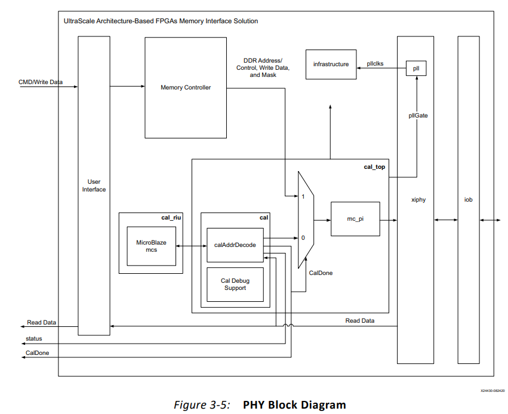
# JEDEC Standard
## Pinout Description
> 标准说明来自JESD79-4

|Symbol        |Type          | Function     |
| ------------ | ------------ | ------------ |
|CK_t,CK_c     | In           |差分输入时钟信号，所有地址和控制的输入信号在CK_t和CK_c的边沿交叉处采样|
|CKE, (CKE1)   | In           |时钟使能信号，高有效。读写访问期间都需要拉高|
|CS_n, (CS1_n) | In           |片选信号，拉高时所有命令失效。在多RANK的组合系统中，CS_n用于选择有效的外部rank，是command的组成部分|
|C0,C1,C2      | In           |Chip ID ，尽在使用3D堆叠工艺的设备上使用|
|ODT, (ODT1)   | In           |On Die Termination：使能DDR4 SDRAM内部的RTT_NOM终端电阻。当通过Mode Register 使能TDQS时，对于x16配置，ODT应用于每个DQ、DQSU_t、DQSU_c、DQSL_t、DQSL_c、DMU_n和DML_n信号。如果MR1被配置为禁用RTT_NOM, ODT引脚将被忽略。|
|ACT_n         | In           |与CS_n一起定义输入的激活命令|
|RAS_n/A16. CAS_n/A15. WE_n/A14 | In | command的组成部分|
|DM_n/DBI_n/TDQS_t, (DMU_n/DBIU_n), (DML_n/DBIL_n)| IO |Data Mask and Data Bus Inversion:DM_n是写数据的输入掩码信号。在写访问期间，当DM_n被采样为LOW时，输入数据将被屏蔽。DM_n会被DQS的双边采样。通过MR5中的模式寄存器A10,A11,A12设置可以选择使用DM 或 DBI功能。DBI_n是一个输入/输出信号，用于标识是存储/输出真实数据还是反向数据。如果DBI_n为低，则数据在DDR4 SDRAM内取反后存储/输出，如果DBI_n为高则不取反。TDQS仅在X8中支持|
|BG0 - BG1   | In   |在执行ACT，READ ，WRITE，Precharge命令时决定支持的BankGroup，BG0在MRS命令中决定访问哪个模式寄存器。X4/8有BG0和BG1，但X16只有BG0|
|BA0 - BA1  |In | Bank Address Inputs ：在执行ACT，READ ，WRITE，Precharge命令时决定支持的Bank，在MRS命令中决定访问哪个模式寄存器。|
|A0 - A17 | In | 为ACTIVATE Commands提供行地址，为Read/Write命令提供列地址，以便从不同Bank的内存数组中选择一个位置。在MRS命令中也提供操作码。A17 is only defined for the x4 configuration.|
|A10 / AP   | In | 读/写命令时采样A10，判断是否应在读/写操作后对被访问Bank进行auto Precharge。 (HIGH: Autoprecharge; LOW: no Autoprecharge)。在Precharge命令期间用于确定Precharge是否适用于一个bank(A10)低或所有bank(A10高)。如果只有一个bank需要precharge，则按bank地址选择。|
|A12 / BC_n | In | Burst Chop: 在读和写命令期间采样，以确定是否执行Burst Chop。|
|DQ | In Out| 双向数据总线|
|DQS_t, DQS_c, DQSU_t, DQSU_c, DQSL_t, DQSL_c | In Out |Data Strobe: 读访问时为输出，与DQ边沿对齐；写访问时为输入，与DQ中心对齐，For the x16, DQSL corresponds to the data on DQL0-DQL7; DQSU corresponds to the data on DQU0-DQU7. |

## State Diagram Command Definitions


## Basic Functional Description
对于存储设备的读写访问是基于突发传输的。访问从选定的地址开始，连续访问一个突发长度的地址，突发长度可以由寄存器配置为BL（burst length）=8,或者BC（burst chop）=4两种模式。访问设备前，先要执行ACT命令，随后是读或者写命令。与ACT命令一同设置的adr信号用于选择要访问的bank，bankgroup，row地址。与读写命令一起设置的adr信号用于选择column地址。并通过A10决定是否需要auto precharge。A12选择BC4或者BL8模式（on the fly OTF mode），前提是在模式寄存器中配置过。
1. 对DDR4 SDRAM的读和写操作是以突发为导向的。它从一个选定的位置开始（由用户提供的地址指定），并继续进行4个或8个突发长度。
2. 读取和写入操作是一个两步过程。它以 ACTIVATE 命令开始（ACT_n 和 CS_n 在一个时钟周期内变为低电平），然后是 RD 或 WR 命令。
3. 与 ACTIVATE 命令同时注册的地址位用于选择要激活的 BankGroup、Bank 和 Row（x4/8 中的 BG0-BG1 和 x16 中的 BG0 选择 bankgroup；BA0-BA1 选择 bank；A0-A17 选择row）。此步骤也称为 RAS - Row Address Strobe(RAS - 行地址选通)
4. 与读或写命令同时注册的地址位用于选择突发操作的起始列位置。此步骤也称为CAS - Column Address Strobe(CAS - 列地址选通)。
5. 每个bank只有一组感应放大器。在对同一bank的不同行进行读/写之前，必须使用PRECHARGE命令解除当前打开的row的激活。PRECHARGE相当于关闭柜子里当前的文件抽屉，它使感应放大器中的数据被写回row中。
6. 可以使用 RDA（自动预充电读取）和 WRA（自动预充电写入）命令，而不是发出显式 PRECHARGE 命令来停用行。这些命令告诉 DRAM 在读取或写入操作完成后自动停用/预充电行。由于列地址只使用地址位A0-A9，A10在CAS期间是一个未使用的位，它被重载以指示自动预充电。
## RESET and Initialization Procedure
依据文档说明，上电释放复位信号后激活CKE，随后依次配置MR3,6,5,4,2,1,0。然后发送ZQCL校准命令，等待tDLLK和tZQ初始化完成。
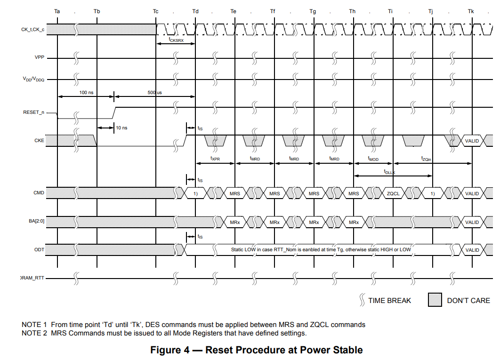


所有的时间参数均可在JDEC最后的附录找到，以tZQin为例；

仿真波形中 发送ZQCL命令后1029个cycle 拉高init_calib_complete 信号，符合文档说明；
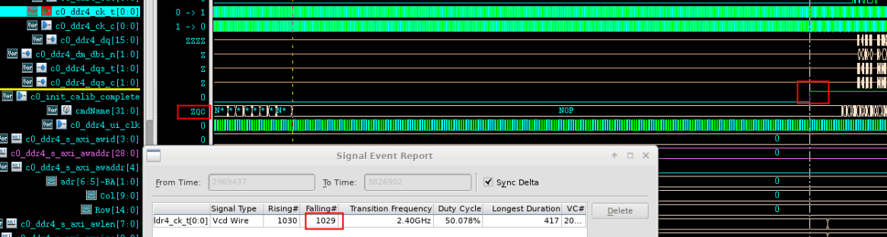

## Register Definition
### Programming Mode Registers
DDR4 SDRAM提供了许多特性、功能和设置，可以使用7个模式寄存器进行编程。这些寄存器可以使用MRS（模式寄存器设置）命令进行编程。模式寄存器在初始化过程中被设置，此后在正常操作过程中可以随时改变它们。模式寄存器的设置受两个定时参数的制约。
|参数 |功能|
|---|---|
| tMRD |MRS命令周期时间。它是完成对模式寄存器的WRITE操作所需的时间，也是tMRD时序图中显示的两个MRS命令之间所需的最小时间。|
|tMOD | 是指从一个MRS命令到一个非MRS命令所需的最短时间，不包括DES。|

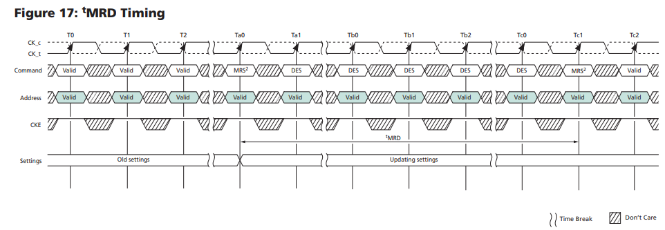
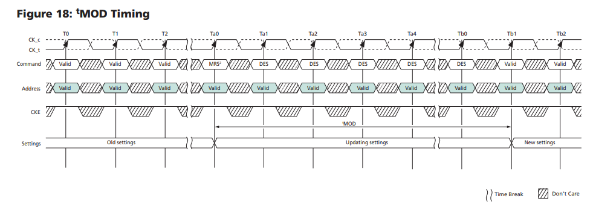
###  Mode Register 
此处依照初始化配置的顺序MR3,6,5,4,2,1,0来说明。参考真值表，当ACT为1，CS，RAS，CAS，WE为0时进入MRS模式。
- MR3

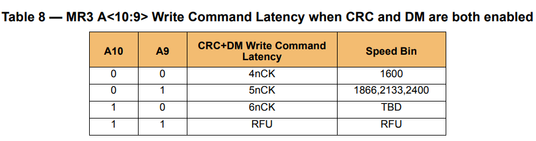
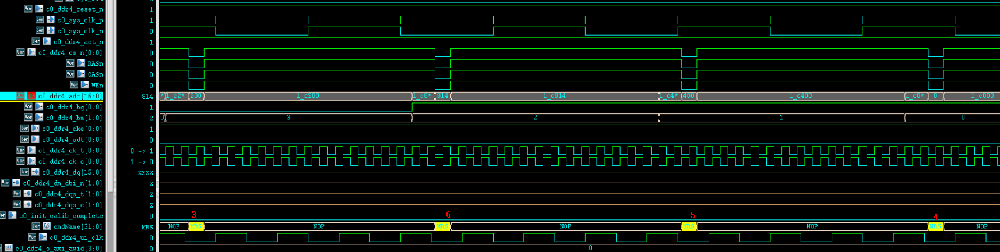

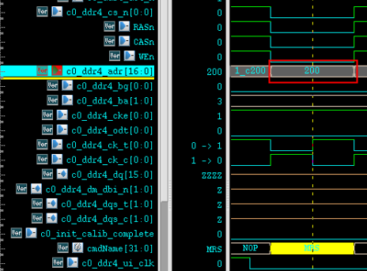
该example中MR3只配置了A9=1；CRC+DM Write Command Latency = 5n Cycle；
- MR6


A11=1 ,tCCD_L=6;
- MR5

A10=1 ,使能DM。关闭DBI；
- MR4

CMD (CAL) address latency =0
- MR2

A3=1，A4=1 CWL=12,CWL具体含义在读写时序中介绍。
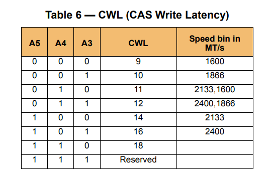
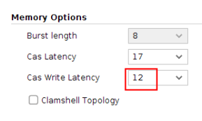
- MR1

Additive Latency AL = 0 ；
- MR0
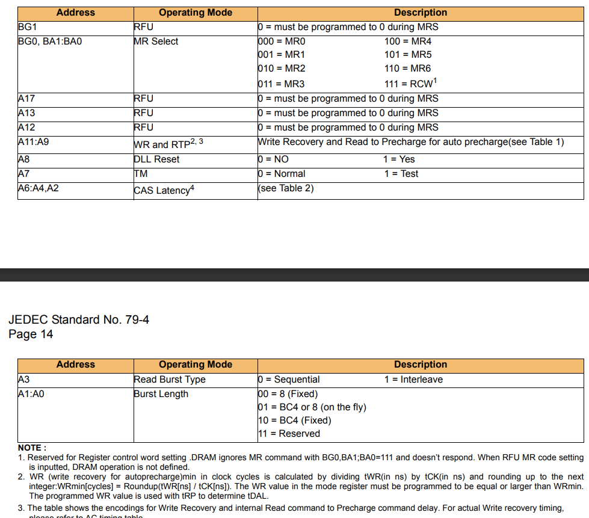
BL = 8；CL=17；
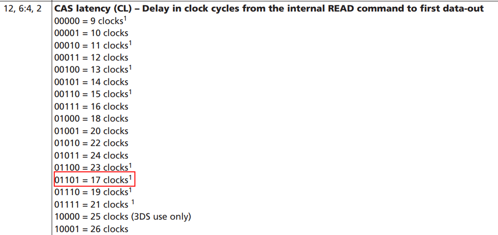
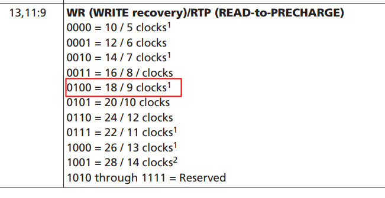
## Command Truth Table

### ACTIVATE Command
activate命令用于打开(激活)特定bank中的一行（Row），以供后续访问。该Row会保持激活状态直到向该bank发送precharge命令。当需要访问同一bank不同row时，必须先发送precharge命令以取消激活，这是因为一个bank中只有一组用于提取电压信号的感应放大器。在ACT命令中有3个关键参数。
|parameter | Functional description|
| ----| ----|
|tRRD_S |当向不同 bank group 的 bank 发出连续的 ACTIVATE 命令时，ACTIVATE 命令必须用 tRRD_S 分隔（row-to-row delay--short）|
|tRRD_L|如果bank属于同一个bank group，则它们的 ACTIVATE 必须由 tRRD_L （row-to-row delay--long）分隔。|
|tFAW |fifth activate window tFAW 指定一个窗口，在该窗口内只能发出四个激活命令。因此，你可以在它们之间使用 tRRD_S 背靠背发出 ACTIVATE 命令，但是一旦你完成了 4 次激活，在 tFAW 窗口到期之前，你无法再发出另一个。|

 
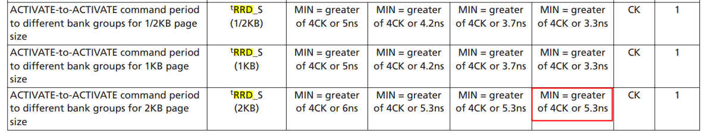
Notes: 1. Maximum limit not applicable.
在镁光的协议中没有规定tRRD 的最大值，只规定了DDR4-2400的tRRR_S/L min=4cycles tFAW=28cycles

我们看一下example中的设定,这几个参数在mig中写为了固定值

在实际波形中可以看到，在xilinx的控制器中并没有区分是否为相同BG，而是将tRRD统一使用8个cycle(大于7就行)。
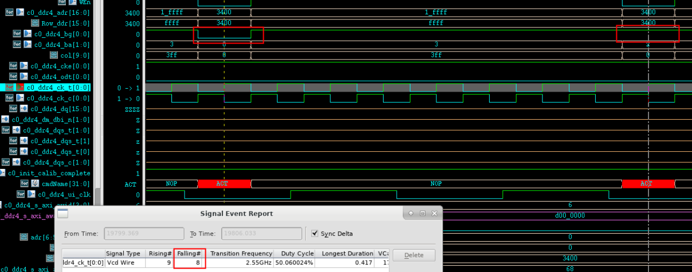
第1次和第5次ACT命令之间间隔40个cycyle（大于37）
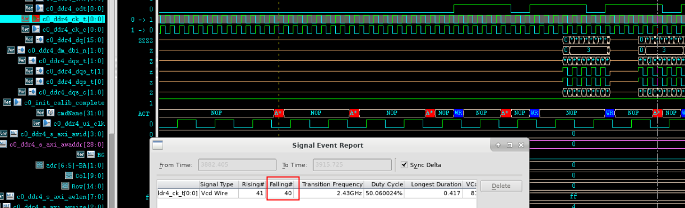

### PRECHARGE Command
PRECHARGE命令用于取消激活某个bank中已激活的row或所有bank中已经激活的row。在PRE命令发送的一个特定时间(tRP)后，可以发送ACT命令继续访问。
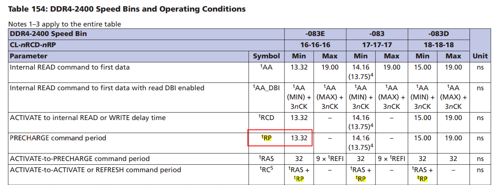
tRP=13.32ns
有一种例外情况是同时发生了auto precharge，此时只要不打断当前的数据传输以及违反其他时序参数，允许向不同bank发送读写访问请求。
在一个bank precharge完成后将进入idel状态，在进行任何读写访问前，需要先发送ACT请求。
在进行读写访问时如果A10信号为高那么会进行auto precharge。该功能会使用RAS的锁存电路来内部延迟precharge操作，直到ARRAY RESTORE操作完成。也就是说在突发访问序列的最后一个数据正确地存储在存储器阵列之后，PRECHARGE操作才会开始。

### REFRESH Command
刷新命令用于防止动态存储器的存储信息丢失。在发送刷新命令请求时，会由DRAM内部的刷新控制器自动生成地址，所以对于控制方并不需要关心地址。在发送刷新请求前，所有bank必须进行precharge操作并处于idle状态一段时间(tPR)。在刷新完成后，所有的bank也会保持idle状态。在REF命令和下一个有效命令间需要保持一个延迟tRFC。
通常来说，存储设备需要在平均每个tREFI 期间请求一次REF 命令。但为了减少读写访问期间因为REF操作而造成的性能损失，DDR4允许REF命令推迟。可以推迟的REF 命令次数取决于MR3中配置的刷新模式(1x,2x,4x)。当设备处于1X刷新模式时，最多可以延迟8条REFRESH命令。
|parameter | Functional description|
| ----| ----|
|tREFI |该设备需要 REFRESH 命令的平均间隔为 tREFI|
|tRP|预充电时间。在应用 REFRESH 命令之前，必须对bank进行预充电并在 tRP 期间处于空闲状态|
|tRFC |REFRESH 命令和下一个有效命令之间的延迟，DES 除外|


MR3中可以设置刷新模式

附录中有规定 tREF值

在MIG中 REF和REFI是固定值

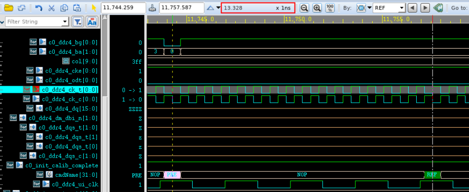
在执行REF前，先执行PRE，时间间隔为13.328ns 与tRP对应

在执行REF后322个cycle再执行其他命令，322>tRFC

两次刷新间隔9332cycles

### READ Operation
|parameter | Functional description|
| :----| :----|
|CL (CAS Latency) |CAS 是 Column-Address-Strobe， <br>CL 是内部 READ 命令与输出数据的第一bit可用之间的延迟，以时钟周期为单位。<br>它在 MR0 模式寄存器中定义。 <br>SDRAM 数据表通常会具体说明需要为特定操作频率设置的 CL|
|AL (Additive Latency)|通过AL,设备允许在ACTIVATE命令后立即发出WRITE命令。<br>该命令在设备内部发出前会被保留AL的时间。<br>支持这一功能是为了维持设备中更高的带宽/速度|
|RL (Read Latency) |这是整体读取延迟，定义为 RL = CL + AL|
|tCCD_S & tCCD_L|与同一bank组内的bank存取相比，不同bank组的bank存取需要较少的存取时间延迟。<br>对不同bank组的bank访问需要在命令之间有tCCD_S（或更短）延迟，<br>而同一bank组内的bank访问需要在命令之间有tCCD_L（或更长）延迟|


example中 AL=0，CL=17，BL=8；


### WRITE Operation
|parameter | Functional description|
|  :----------| :-------|
|CWL  |(CAS Write Latency)CWL是内部WRITE命令与输入数据的第1 bit可用之间的延迟，<br>以时钟周期为单位。<br>它被定义在模式寄存器MR2中|
|AL |(Additive Latency)通过AL，设备允许在ACTIVATE命令后立即发出WRITE命令。<br>该命令在设备内部发出前会被保留AL的时间。<br>支持这一功能是为了维持设备中更高的带宽/速度|
|WL |(Write Latency)这是整体写入延迟，定义为 WL = CWL + AL|
|tCCD_S/L|与同一bank组内的bank存取相比，不同bank组的bank存取需要较少的存取时间延迟。<br>对不同bank组的bank访问需要在命令之间有tCCD_S（或更短）延迟，<br>而同一bank组内的bank访问需要在命令之间有tCCD_L（或更长）延迟|


example中 AL=0 ，CWL=12，BL=8；在第一笔写命令中，WL=CWL+AL=12符合预期。
tWPRE=1 tCK,tWPST=0.5 tCK;在MRS中配置了1tCK模式的premble；

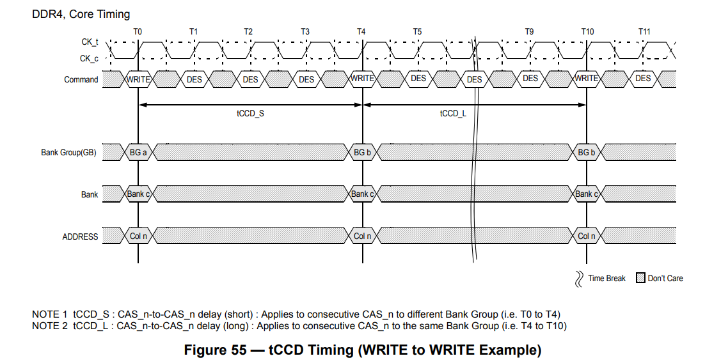
连续写时，两个写命令之间需要间隔tCCD, 本example中tCCD_S=4,tCCD_L=6(MR1配置)；

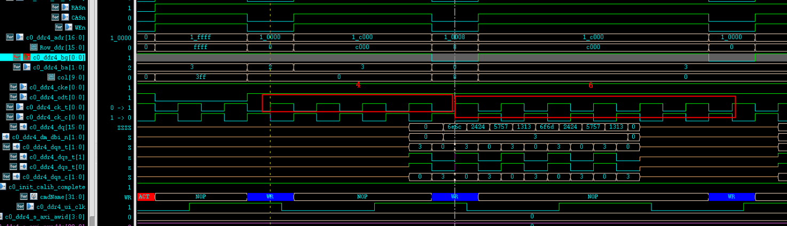
