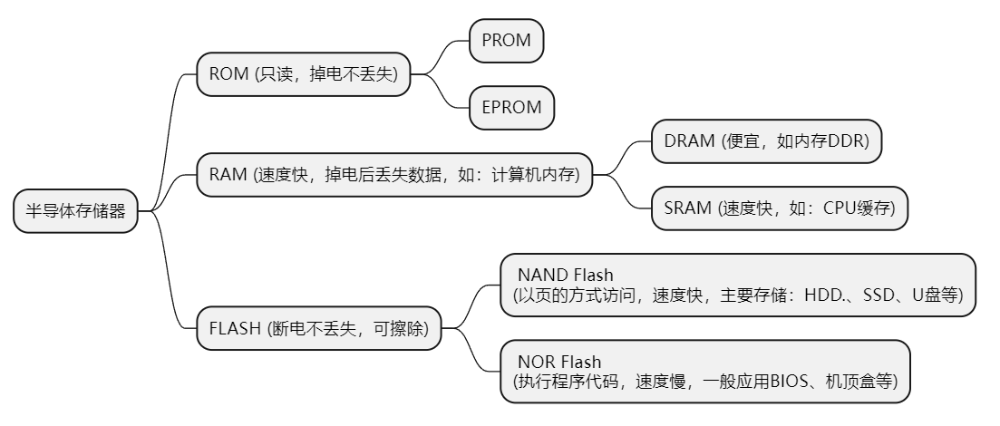

<!-- TOC -->

- [基于xilinx MIG DDR4 axi4访问example](#基于xilinx-mig-ddr4-axi4访问example)
    - [example生成steps](#example生成steps)
- [DDR基础知识](#ddr基础知识)
- [MIG 配置说明](#mig-配置说明)
- [Memory Controller](#memory-controller)
- [Phy](#phy)

<!-- /TOC -->
# 基于xilinx MIG DDR4 axi4访问example  
> 以xczu2eg芯片通过MIG 配置单颗 MT40A256M16 DDR4颗粒仿真为例。  
## example生成steps  
> 此处只介绍生产example的步骤，相关过程中介绍在后续详细展开说明。

1. 找到ip  
            
2. 配置ip
选项说明
    
    
3. 生成xilinx自带的仿真example
    - 等待ip综合完成后打开example
        
4. 仿真
    - 使用vvd仿真
      直接开始仿真就行，可以run all，直到仿真自动停止。
    - 使用vcs仿真
        
        - 在sim_tb_top.sv加入fsdb选项
        ```verilog
        initial
        begin
            $fsdbDumpfile("tb.fsdb");
            $fsdbDumpvars(0,sim_tb_top,"+all");
        end
        ```
        - 修改sim_tb_top.sh
            加入kdb选项以支持verdi
            
            编译时会提示缺少include`文件，需要加入仿真模型
            
        - bsub -Is ./sim_tb_top.sh &
5. 修改ddr4_v2_2_data_gen.sv
    ```verilog
          always @ (*) begin
            lfsr_q_nxt <= lfsr_q;
            if (pattern_init) begin //pattern initialisation
            //lfsr_q_nxt <= #TCQ {prbs_seed_i + 32'h55555555};
            lfsr_q_nxt <= #TCQ {prbs_seed_i + 32'h13572468};
            end
            else if (data_en) begin //generate next data packet
            // lfsr_q_nxt[32:9] <= lfsr_q[31:8];
            // lfsr_q_nxt[8]    <= lfsr_q[32] ^ lfsr_q[7];
            // lfsr_q_nxt[7]    <= lfsr_q[32] ^ lfsr_q[6];
            // lfsr_q_nxt[6:4]  <= lfsr_q[5:3];
            // 
            // lfsr_q_nxt[3]    <= lfsr_q[32] ^ lfsr_q[2];
            // lfsr_q_nxt[2]    <= lfsr_q[1] ;
            // lfsr_q_nxt[1]    <= lfsr_q[32];
            lfsr_q_nxt <= lfsr_q + 1;
            end
        end
    ```
    > 修改一下自动生成的数据，方便观察axi到dq的数据映射。不改也行。
6. 简单看一下仿真波形
    - 先关注cmdName信号（设置为ASCII格式），仿真开始后经过一段时间的ACT/NPO后会进行MRS操作（圆圈处），之后init_complete拉高，axi总线动作，开始访问DDR。
        
# DDR基础知识
- 半导体存储概念
    
- 认识DDR 内存条
    
    以一根DDR内存条为例，从大到小的层级结构依次是：channel ＞ DIMM ＞ rank ＞ chip ＞ bank ＞ row/column。
    channel （对应多个DDR控制器）> DIMM（内存插槽） > rank（一次访问位宽决定，也成物理bank） > chip（1个chip大多是4bit/8bit/16bit等，由多个chip组成一个rank，配合完成一次访问的位宽要求。这就是颗粒。） > bank（颗粒里的logic-bank，DDR3一般对应8个bank存储体） > row/column。
    
# MIG 配置说明
> 参考pg150
1. Mode & Interface
    从左往右分别为：
    - 用户逻辑层：要送进DDR存储起来的数据源，比如CMOS，ADC等模块采集的数据集；
    - 用户接口层： xilinx mig有user interface和AXI4可选，此处使用AXI4；
    - 控制器层：[Memory Controller](#memory-controller)
    - PHY 层：[Phy](#phy)
    - DDR SDRAM: 实际接的内存芯片，仿真中使用的是sv写的仿真模型。
# Memory Controller    

# Phy
