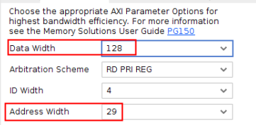

<!-- TOC -->

- [基于xilinx MIG DDR4 axi4访问example](#基于xilinx-mig-ddr4-axi4访问example)
    - [example生成steps](#example生成steps)
- [DDR基础知识](#ddr基础知识)
- [MIG 配置说明](#mig-配置说明)
- [Memory Controller](#memory-controller)
- [Phy](#phy)

<!-- /TOC -->
# 基于xilinx MIG DDR4 axi4访问example  
> 以xczu2eg芯片通过MIG 配置单颗 MT40A256M16 DDR4颗粒仿真为例。  
## example生成steps  
> 此处只介绍生产example的步骤，相关过程中的介绍在后续展开详细说明。

1. 找到ip  
        
2. 配置ip
选项说明


3. 生成xilinx自带的仿真example
- 等待ip综合完成后打开example

4. 仿真
- 使用vvd仿真
直接开始仿真就行，可以run all，直到仿真自动停止。
- 使用vcs仿真

- 在sim_tb_top.sv加入fsdb选项
 ```verilog
 initial
 begin
     $fsdbDumpfile("tb.fsdb");
     $fsdbDumpvars(0,sim_tb_top,"+all");
 end
 ```
 - 修改sim_tb_top.sh
 加入kdb选项以支持verdi
 
 编译时会提示缺少include`文件，需要加入仿真模型
 
 - bsub -Is ./sim_tb_top.sh &
5. 修改ddr4_v2_2_data_gen.sv
```verilog
      always @ (*) begin
        lfsr_q_nxt <= lfsr_q;
        if (pattern_init) begin //pattern initialisation
        //lfsr_q_nxt <= #TCQ {prbs_seed_i + 32'h55555555};
        lfsr_q_nxt <= #TCQ {prbs_seed_i + 32'h13572468};
        end
        else if (data_en) begin //generate next data packet
        // lfsr_q_nxt[32:9] <= lfsr_q[31:8];
        // lfsr_q_nxt[8]    <= lfsr_q[32] ^ lfsr_q[7];
        // lfsr_q_nxt[7]    <= lfsr_q[32] ^ lfsr_q[6];
        // lfsr_q_nxt[6:4]  <= lfsr_q[5:3];
        // 
        // lfsr_q_nxt[3]    <= lfsr_q[32] ^ lfsr_q[2];
        // lfsr_q_nxt[2]    <= lfsr_q[1] ;
        // lfsr_q_nxt[1]    <= lfsr_q[32];
        lfsr_q_nxt <= lfsr_q + 1;
        end
    end
```
> 修改一下自动生成的数据，方便观察axi到dq的数据映射。不改也行。
6. 简单看一下仿真波形
- 先关注cmdName信号（设置为ASCII格式），仿真开始后经过一段时间的ACT/NPO后会进行MRS操作（圆圈处），之后init_complete拉高，axi总线动作，开始访问DDR。

# DDR基础知识
- 半导体存储概念

- 认识DDR 内存条

以一根DDR内存条为例，从大到小的层级结构依次是：channel ＞ DIMM ＞ rank ＞ chip ＞ bank ＞ row/column。
channel （对应多个DDR控制器）> DIMM（内存插槽） > rank（一次访问位宽决定，也成物理bank） > chip（1个chip大多是4bit/8bit/16bit等，由多个chip组成一个rank，配合完成一次访问的位宽要求。这就是颗粒。） > bank（颗粒里的logic-bank，DDR3一般对应8个bank存储体） > row/column。

- DDR Page的概念和理解
- DDR页的概念，是针对刷新或者访问来说的，举例，一个rank可能有4个chip组成，一个chip里可能有8个bank，每一个bank有N个行。页指的一个rank里每个chip里的所有bank的某个行地址；注意不是一行，是多行，行数是chip数目*bank数目。
- 所以，DDR页，可以理解为一个rank里每个chip（所有bank）的行地址
- 在一个rank里，每个chip的地址是相同的。因为多个chip组成一个总数据位宽。DDR接口的cs信号，虽然叫chip select，其实是rank（一chip）的 select。
- DDR页的概念，会涉及页命中、页miss等，跟cache page原理一样。
# MIG 配置说明
> 参考pg150
1. Mode & Interface
从左往右分别为：
- 用户逻辑层：要送进DDR存储起来的数据源，比如CMOS，ADC等模块采集的数据集；
- 用户接口层： xilinx mig有user interface和AXI4可选，此处使用AXI4；
- 控制器层：[Memory Controller](#memory-controller)
- PHY 层：[Phy](#phy)
- DDR SDRAM: 实际接的内存芯片，仿真中使用的是sv写的仿真模型。
2. Clocking
Memory Device Interface Speed指实际的内存芯片使用的时钟，对应ddr4_ck_c/t信号，是一对差分时钟。
在MT40A256M16GE 的文档中可以看到083E速度等级对应的是2400MT/s数据传输速率，这个指的是每秒钟可以进行2400M次传输，因为DDR会在c/t时钟各自的上升沿分别传输一次，所以实际时钟频率为2400M/2=1200MHz=833ps。

PHY to controller click frequency ratio 固定为4:1;即Memory Controller的时钟为1200M/4=300MHz，也是用户接口层使用的时钟，ui_clk；
Ref Input Clk 可以自由选择，对应该MIG使用的系统时钟 c0_sys_clk_p,该example中选的100M；


3. Memory Option
保持默认，具体参考DDRJEDEC
4. Controller Option
MEM类型本例中选择MT40A256M16GE-083E,地址关系如下：

BankGroup width=1；BankArry width=2；Column width =10；Row width=15；data width=16；
Page Size = 2^10^*16/8=2KB
单个颗粒的总大小为 2^10^\*2^15^\*2^2^\*2^1^\*16=256M\*16=4Gb
- *Memory Address Map*
>参考pg150 P119app_addr词条   

推荐使用ROW_COLUMN_BANK的地址映射关系

5. AXI options


根据公式C_S_AXI_ADDR_WIDTH= 0+15+10+2+1+4-3=29

C_S_AXI_DATA_WIDTH=16*8=128
>*axi_address[0]=0;*


从这张表可以知道，AXI地址会在app接口地址上补一个最低位的0，也就是说如果这边不选择axi接口的话，app接口的地址线位宽为28；

再根据这张表我们可以得到该example中axi的地址在DDR4“row_columan_bank"顺序下的映射关系
| SDRAM      | axi_addr mapping |
| ----------- | ----------- |
| rank       | 0       |
| Row   | axi_addr4[28:14]        |
| Column | axi_addr4[13:7],axi_addr4[3:1]  |
| Bank | axi_addr4[6:5] |
| Bank Group | axi_addr4[4:4] |


# Memory Controller  
Memory Controller (MC)接收用户侧发来的地址、数据、控制命令，并通过满足DRAM协议与时序要求的方式，低延迟高效率的发送至PHY。控制器时钟与DRAM时钟的比例为4：1，在每个系统时钟的周期都可以发送一次ACT，CAS，Pre命令。

# Phy
