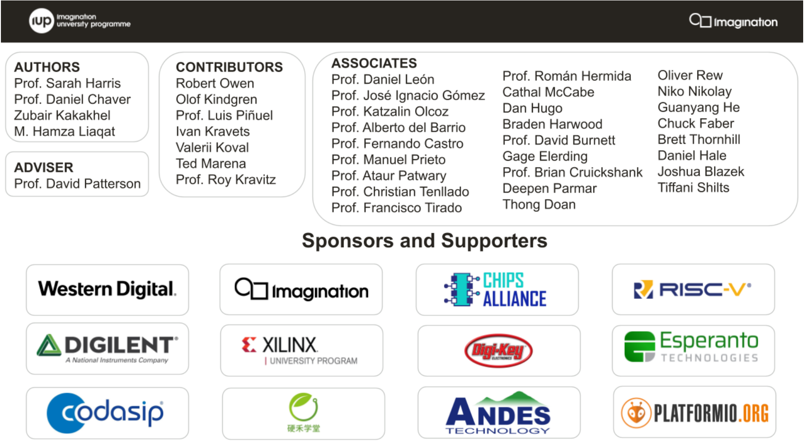

# 基于RVfpga的接口实验

## 目录

+ [前言](#foreword)
+ [实验环境安装指南](https://gitee.com/foxtrot024/RVfpga_SoC/blob/lab0)
+ [实验1：RVfpgaSoC入门](https://gitee.com/foxtrot024/RVfpga_SoC/tree/lab1/)
+ [实验2：在RVfpgaSoC上运行软件](https://gitee.com/foxtrot024/RVfpga_SoC/tree/lab2) 
+ [实验3：GPIO 实验](https://gitee.com/foxtrot024/RVfpga_SoC/tree/lab3)
+ [实验4：UART 串行接口实验](https://gitee.com/foxtrot024/RVfpga_SoC/tree/lab4)  
+ [实验5：基于AXI4的自定制接口实验](https://gitee.com/foxtrot024/RVfpga_SoC/tree/lab5) 
+ [实验6：定时器实验](https://gitee.com/foxtrot024/RVfpga_SoC/tree/lab6) 
+ [实验7：中断实验](https://gitee.com/foxtrot024/RVfpga_SoC/tree/lab7) 
+ [实验8：模拟量接口实验](https://gitee.com/foxtrot024/RVfpga_SoC/tree/lab8) 
+ [实验9：DMA 实验](https://gitee.com/foxtrot024/RVfpga_SoC/tree/lab_dma) 
+ [实验10：接口综合实验](https://gitee.com/foxtrot024/RVfpga_SoC/tree/lab9) 
+ [汇编语言实验](https://gitee.com/foxtrot024/RVfpga_SoC/tree/lab_asm) 
+ [Verilog语言实验](https://gitee.com/foxtrot024/RVfpga_SoC/tree/lab_verilog) 

##  前言

基于 Imagination 大学计划开源的 RVfpgaSoC，通过讲课和实验，使学生了解和掌握接口技术，
并采用基本的接口模块，运用EDA工具通过IP集成的方式搭建一个简单的嵌入式应用系统。

## 致谢

